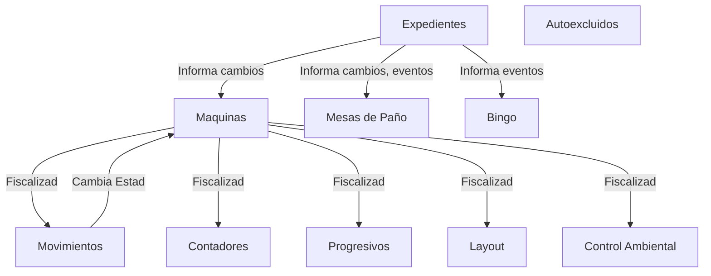

## Sistema de auditoria de Casinos Físicos de Lotería Santa Fe

El principal sistema de auditoria. 

Se divide en varios modulos, algunos funcionando como subsistemas cuasi-aislados y otros integrados.

Los modulos de los cuales derivan todos los demas controles son:

* Expedientes
* Maquinas
* Mesas de Paño
* Bingo
* Autoexcluidos
* Canon

Ortogonalmente, se hallan algunas o todas de las siguientes actividades sobre los modulos:

* Gestión (Carga y Modificación)
* Fiscalización (Verificación física)
* Auditoría (Verificación contra datos informados)
* Informes (Visualización de estado)

Esbozandolo en forma tabular 

| Modulo\Actividad | Gestión                                                                 | Fiscalización                                                   | Auditoría                                                    | Informes                                             |
| ---------------- | ----------------------------------------------------------------------- | --------------------------------------------------------------- | ------------------------------------------------------------ | ---------------------------------------------------- |
| Expedientes      | Expedientes, Resoluciones, Notas, Disposiciones                         | #N/A                                                            | #N/A                                                         | #N/A                                                 |
| Maquinas         | Maquinas, Islas, Sectores, Juegos, Formulas, Certificados, Progresivos  | Movimientos, Contadores, Progresivos, Layout, Control Ambiental | Importacion y Validación: Contadores, Producidos, Beneficios | Estado Casino, Relevamiento, Sector, No toma         |
| Mesas de Paño    | Juegos y Sectores, Mesas                                                | Cierres, Aperturas, Apuestas Minimas, Control Ambiental         | Importación y Validación: Cierres, Producidos                | Informe Diario, Mensual, Anual                       |
| Bingo            | Premios                                                                 | Sesiones                                                        | Importación y Validación: Sesiones                           | Reportes de Diferencia                               |
| Autoexcluidos    | Autoexcluidos                                                           | Galería                                                         | #N/A                                                         | Listado                                              |
| Canon            | Canon                                                                   | #N/A                                                            | #N/A                                                         | Devengado y Determinado                              |

Como se nota, hay modulos que se representan en el beneficio del Casino (Maquinas, Mesas, Bingo) y otras auxiliares al funcionamiento del sistema (Expedientes, Canon)
Se presentan otras pantallas para visualización gerencial de tableros generales o de descarga de datos ("Backoffice") que son auxiliares y abarcan a todo el sistema
Todo el sistema confluye al cierre del mes en un Canon, donde en el mismo se hace el agregado de todos los datos de beneficio (ganancia) del casino y se calcula el pago mensual de este como canon

Las relaciones entre los modulos son en grandes razgos

## License

Open-sourced software licensed under the [MIT license](http://opensource.org/licenses/MIT).
